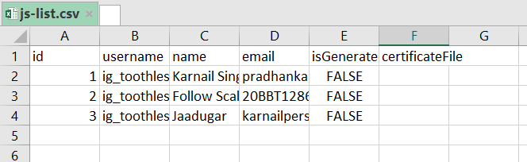

# Generate Certificate

**REQUIRED -**

`template` - In template directory paste the format of the certificate and update the path of template in `main.py`

`csv_file` - Add CSV file in the root directory and update the path in `main.py` and also in `mailcert.py`

format


**Commands =**

`Generate Certificates`
```
python main.py
```

`Send Certificates in mail`
```
python mailcert.py
```

**`-------Priority-----------`**

For sending mails 2 props must required

`me`: your email address from where you want to send emails

`app_pass`: app password -> Need to generate it from the gmail settings --> 2FactorAuthentication --> settings ---> createApp and copy the password and add it.

That's it.

`git clone <this repo> and run pip install -r requirements.py`

```
Give your valuable suggestions.
```
